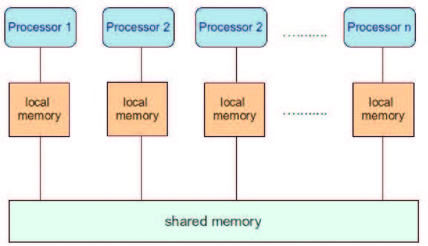

# Parallel Matrix Multiplication Methods
* Various Parallel Matrix Multiplication techniques are available which can be categorized based on the Memory architecture
    1. Shared Memory
    2. Distributed Memory
* Matrix Multiply can be embedded in the hardware

## Shared Memory
1. In a shared memory architecture, every Processing Element(PE) has the same view of memory and access memory irrespective of what other processor does.
2. We have to assume that Matrices fit into the shared memory or handled by virtual memory mechanisms.


3. But we also assume there is a much faster but smaller local memory(cache) that is available to each PE and is managed by hardware(not always). 

4. The memory is also private to each processing element and there is no mechanism for acessing other's memory

5. Every memory access to the memory is routed through the local memory and the results are cached there. The local memory supports certain memory access pattern and policies on which elements should stay there. The two typical memory access patterns are 
    1. Temporal Locality
    2. Spatial Locality



### Algorithmic Optimization for Shared Memory

1. Since all the PE have access all the elements there is no problem of data placement. Also the local memory is hardware managed which is governed by the data access pattern of the PE.

2. Now the PE has to make sure that the elements accessed fit into the local memory and doesnot go to the shared memory frequenly. Also PE follow spatial and temporal memory access patterns.

### Naive Matrix Multiplication

```C++
// C = (m x n), A = (m x k), B = (k, n)
for(size_t i = 0; i < m; i++){
    for(size_t j = 0; j < n; j++){
        for(size_t l = 0; l < k; l++){
            C[i][j] += A[i][l] * B[l][j];
        }
    }
}

```

1. The approach is the access schedule one or more non overlapping row to each PE.
2. Each PE performs computation dot product with the other matrix and stores the result to the resultant matrix.


## Problems with Naive Matrix Multiplication

1. If the dimensions of the matrix exceeds the size of local memory, every fetch will be directed to the shared memory instead of local memory.
2. Also Matrix B is not access in a row major fashion 