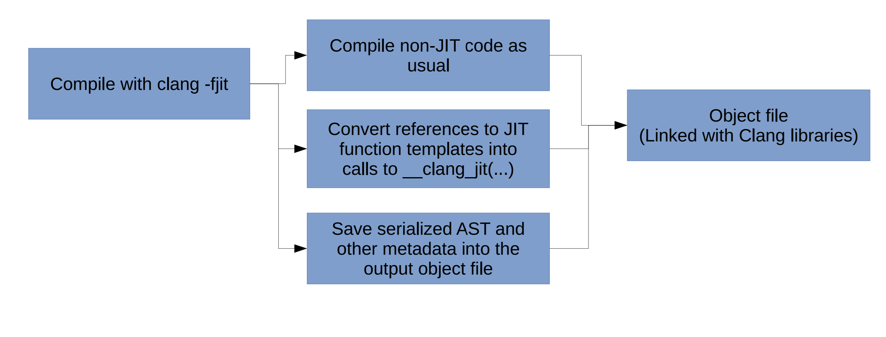

# Even Better C++ Performance and Productivity - Hal Finkel
**About Hal Finkel**: Lead for Compiler Technology and Programming Languages at the ALCF
**slides**: https://llvm.org/devmtg/2019-10/slides/Finkel-EvenBetterCPlusPlusPerformance.pdf
**github**: https://github.com/hfinkel/llvm-project-cxxjit/wiki
**paper**: https://arxiv.org/abs/1904.08555

* Hal started with the problem for supporting Autotuning in their workflow which is predominantly HPC
    * Autotuning is where you tune the code by searching a space parameterized by the program structure. For example, Loop trip count
    * But for the cases of C++, where tuning the code requires substituting and recompiling the code which is a time consuming task for template heavy code
    * That is where the idea for supporting JIT for template specialization in C++ started
* JIT is very prevelant in the modern browser where you don't have a choice but to JIT compile because of interactivity and also in the server space where languages like Java, Scala or any JVM languages jit compile for possible high performance gains
* For the  case of C++ programmer, the usecase dicussed here is Template Specialization Overhead which is covered in the compile-time and moving it the runtime arena for programmer productivity and performance
* A lot of HPC codebases use template specialization through policies to force the compiler to generate the most efficient code
* Inorder for the code to be portable both in performance and usability but not take a lot of time to compile is the aim of the talk
* C++ JITs have always been there like XLA, Halide, OpenCL, SYCL, ArrayFire, PCRE JIT, Blend2D etc use JIT compilation through a library interface like LLVM JIT, NativeJIT etc but they are more low level and a lot of the time emit assembly which is hard for any typical user
* Requirements for ClangJIT
    * Not a significant language change
    * Shouldn't access source files during execution
    * JIT compilation must be incremental, no repeating the work

## ClangJIT for C++
* ClangJIT enables runtime specialization of templates by allowing values and types to be used for template parameters. Strings are allowed a values for template parameters which is useful when the JIT is invoked using a configuration script
* ClangJIT allows users to attach attributes to `template functions` like `[[clang::jit]]` and this allows clang to generate intermediate files for runtime JIT compilation. This mechanism is similar to what clang does for modules, similar to pch
* The Template Instantiation happens at runtime which is invoked when the callsite using the template is reached
* But there is a restriction on the set of C++ language that can be used. For example, `function templates` templatized based on return types will not compiles because the callsite depends on the template specialization which is only know during runtime. This is couples the caller with the template function and cannot be allowed. Like a deadlock

