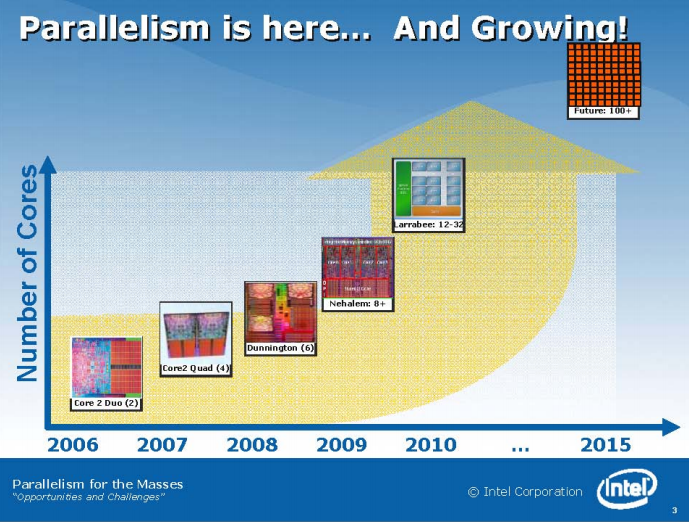
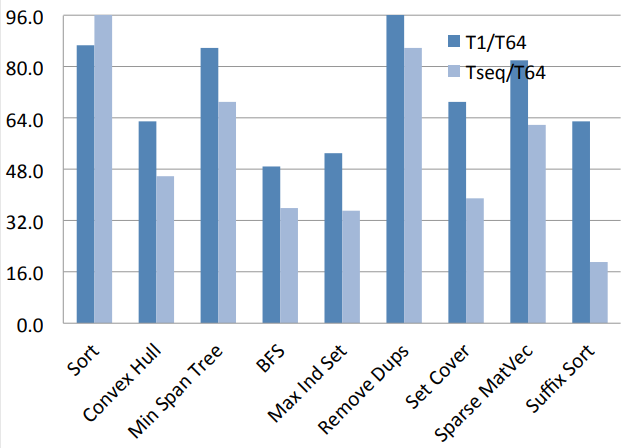

# Introduction to CMU 15-210
* Parallelism is recent and relevant
* Every processor is multi-core and servers processors feature than 8 cores
* So inorder to run them efficiently and save power, programmers must utilize parallelism available in the hardware.
* Paralleism is here and growing

* Performance of Parallel version of the sequential algorithms are way faster and they save power too.

