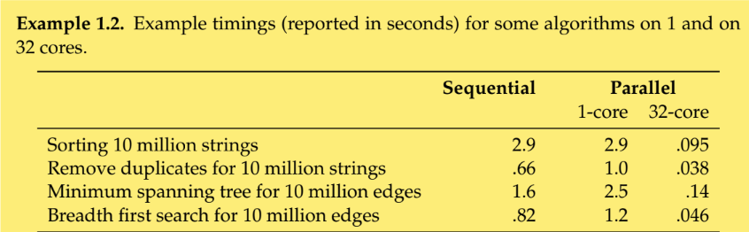

<link rel="stylesheet" type="text/css" media="all" href="../styles/image.css" />

# Cost Modelling of Parallel and Sequential Algorithms and Data Structures
* Modelling cost allows us to choose the best algorithms given a problem specification. In other words, It allows comparing different algorithms given the problem specification
* Formally specifiying the problem is also important because a subtle change in the problem specification change vary the solution completely

## Parallelism
> Parallel Computing: It is the ability to run multiple computation at the same time
* Parallelism is more powerful than sequential computing because 
    1. Complex problems can be solved in a tractable time
    2. Energy consumption required to run on parallel computer is almost halved(not necessarily) compared to sequential computer but running the same computation 2  as fast in a sequential computer requires 8 times more energy(:terminology)
* But there are overheads in doing computation in parallel like setup and synchronization which contributes to little amount of power

> Speedup: It is the ratio of amount of time taken by sequential code(T sub s) to the time taken by parallel code(T sub p)

## Challenges in Parallel Software
* Running sequential algorithms on parallel computers is hard or nearly impossible because
    1. Different Programming Model(Multi-threading vs SIMT vs SPMD)
    2. Different languages(CUDA vs ISPC vs Chapel)
    3. Organization Computation is harder
    4. Perform Optimizations(platform specific)

## Work Span Model
* The most common way of modelling cost of a parallel and also sequential algorithms is `Work-Span` model.
* Inorder to analyse the complexity(cost), Work-Span model requires the algorithm to be specified as a `Directed Acylic Graph(DAG)`

> Work: It is the sum of all individual, atomic(primitive) computations in the algorithm. If running on a sequential computer it is the total time but in a parallel computer we split it among multiple processors and reduce time

> Question: What is the extent of work can be shared?

Ideally we the work to be shared among all the processors evenly. This will 

> Span: It is the length of the longest path in the DAG. It also refers to the minimum time required by the algorithm to complete irrespective of amount of parallelism in the available hardware

* Both of the terms are analysed using asymptotic notations(big-O)

e.g. For Parallel MergeSort, Work is O(nlogn) and Span is O(lg^2 n)

> Perfect Speedup: If an algorithm achieves even speedup i.e. `W / P` is the amount of work for all the processor(data parallel algorithms). But it is not always possible because there are dependencies between computation

* Computing Work and Span

| Description| Work| Span|
| ------------- | ------------- |--------------|
|Sequential Algorithm | 1 + W1 + W2 | 1 + S1 + S2 |
|Parallel Algorithm | 1 + W1 + W2 | 1 + max(S1, S2)|

* The problems with parallel algorithm analysis is that there are two measure to compare with Work and Span.**Work is more important than span. It is always important to reduce work and then span. It is always good to reduce work by designing Work-Efficient algorithm that perform no more work than the best sequential counterpart and then reduce span. But it is sometimes better to tradeoff with work to get improvments in span.**

## Algorithm, Data Structures and Cost Specification

## Algorithm Specification
* This is required for abstract description of the algorithm. It specifies what the algorithm does and not how it is implemented.

* This way there can be many algorithms that meet the algorithm specification
    e.g. Comparison based sorting algorithm specification: Given an array A of n elements taken from a totally ordered set with comparison operator <=, returns the same array B such that B[i] <= B[j] for 0 <= i <= j < n
* cost of specification of an algorithms.
    e.g. for comparison based sorting algorithms for an array of length n, work is O(nlogn) and span is O(log^2 n)

## Data Structure Specification
* A data structure can specified by using Abstract Data(Barbara Liskov) Type Specifiation. 
    e.g. Priority Queue: It is a FIFO data structure with three operations
    1. insert
    2. removeMin
    3. empty

* The cost specificaion of an algorithm
    e.g. The work and span of the priority queue
    1. insert - O(1), O(1)
    2. removeMin - O(lg n), O(lg n)
    3. empty - O(1), O(1)