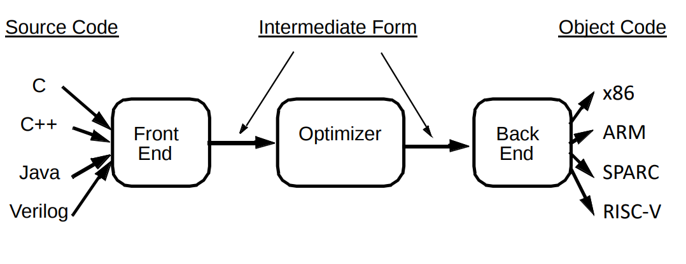
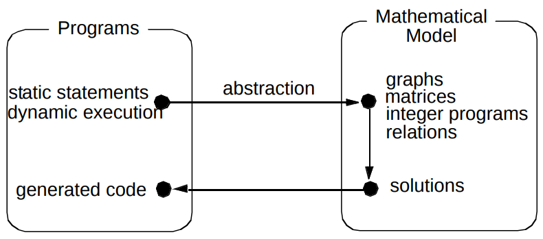

# What is a Compiler?
1. Compiler traslates from one language to another language.
2. If both the languages are of the same abstraction then it is called transpiler.
3. Improve and optimize code.
4. Perform work in parallel.
5. Minimize instruction count because `Execution count = Number of instruction * Clocks per instruction`.
6. Choose instruction optimally.
7. Minimize cache misses.

## Phases of Compiler

1. The most important and interesting phase of compilers is `optimizer`
2. Optimizer works on an intermediate representation which is RISC like(LLVM IR).

## General schematic of an optimizer

1. The program is transformed into a mathematical representation and analysed for possible optimizations.

2. One of the common representation is a **DAG**

## Terminology
1. Three adress code - IR representation where an instruction is represented with atmost three operands. e.g. `A = B op C`
2. Basic block - sequence of three address code, only the first instruction can be reached from outside and the last instruction is the only way to get out and all the instruction must be executed sequentially. Basic blocks must be maximal.
3. local optimization - optimization or transformations done on a basic block level.
4. Flow Graph - A Graph constructed as follows
    * node - basic blocks of a program.
    * edge - if a block Bj an be reachable from Bi then edge can be drawn from Bi->Bj.
    * start node or entry node is the first basic block acting as an entry point into the program.
5. Local optimization - within basic block. e.g. common subexpression elimination, constant folding(compile time computation), dead code elimination.
6. Global optimization - within flow graph across basic blocks. e.g. global subexpression elimination, global dead code elimination, loop invariant code motion, induction variable elimination.
7. interprocedural optimization - with a program across procedures.
8. Machine Dependent optimization - Optimization depending on the machine specific information. e.g. Regsiter allocation, instruction scheduling, Memory hierarchy optimizations.

## Optimization Case study

