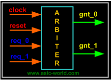
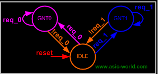
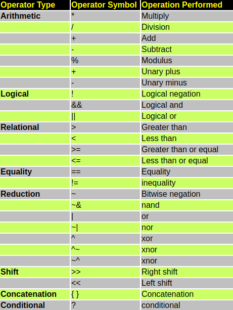

# Notes from ASIC-World
## Introduction
- Verilog is a hardware description language.
- Hardware Description Language is used to describle digital hardware at any level(from flip-flop to a network switch).
```verilog
// A simple D flip-flop
module d_ff(d, clk, q, q_bar);
input d, clk
output q, q_bar
wire d, clk
reg q, q_bar

always @ (posedge clk)
begin
	q <= d;
	q_bar <= !d;
end

endmodule
```
- Verilog allows one to design hardware at different levels of abstraction.
	- Behavoiral Level
	- Register Transfer Language(RTL)
	- Gate level
	- Switch level

## Design Styles
### Bottom-up Design
- Traditional Method.
- Gate-level Design.
- Not scalable.

### Top-Down Design
- Functional method.
- Perfered by most engineers.
- It also allows testing, easy change of different technologies, a structured system design.
- But not practical, so most of the design is hybrid of the the two.


## Verilog Abstraction Levels
### Behavorial Level
- Design is expressed by concurrent algorithms.
- Each algorithm is sequential
- Functions, tasks and blocks are the main elements
- No regard to structural relization of the design

### Regsiter Transfter Language
- Specify circuits by operation and transfer of data between registers
- clock used
- Any code that is synthesizable is called **RTL code**

### Gate Level
- Logical links between components and timing characteristics
- Signals are discrete
- They take only one of the following level (1, 0, X, Z)
- They are programmed using gates
- It is not a scalable method so mostly it is generated by synthesis tools

## Life Before Verilog
- Before verilog chip design was done using schematics.
- They are harder to verify and error-prone with long tedious developement cycles

## Verilog Design Cycle
1. Specification
2. High Level design
3. Low level(micro) design
4. RTL coding
5. Verification
6. Synthesis

## Case Study: Building an arbiter

> Arbiter: A device that selects among two agents competing for mastership.

1. Specification
	- Two agent arbiter.
	- Active high asynchronous reset.
	- Fixed Priority, with agen 0 having priority over agent 1.
	- Grant will be asserted as long as request is asserted.
2. High Level Design



3. Low Level Design



4. RTL coding
- It is automatically generated via verilog.

## Verilog
```verilog
	module arbiter(
		clock,
		reset,
		req_0,
		req_1,
		gnt_0,
		gnt_1
	);
	input clock;
	input reset;
	input req_0;
	input req_1;

	output gnt_0;
	output gnt_1;
```

### Types of Signal
1. input
2. output
3. inout

## Vector Signals
- set of signal
- `inout [7:0] address` represens an 8 bit bidirectional port

### Data Type
- driver is a data type that drives the load to the circuit
	- It can store data(flip-flop) - reg
	- It can connect end-points(wire) - wire

### Operators



### Control Statements

- "{}"  braces are replace by begin and end

1. if-else statement

```verilog

if(enable ==  1'b1) begin
	data = 10;
	address = 16'hDEAD;
	wr_enable = 1'b1;
end else begin
	data = 32'b0;
	wr_enable = 1'b0;
	address = address + 1;
end
```

2. case statement

```verilog
case(address)
	0: $display ("case 1");
	1: $display ("case 2");
	default: $display ("case 3");
endcase
```

3. while statement

```verilog
while (free_time) begin
	$display("While loop");
end
```

4. for loop

```verilog
for(i = 0; i < 16; i = i + 1) begin
	$display("for loop %d", i);
end
```

5. Repeat

```verilog
repeat (16) begin
	$display("repeat loop %d", i);
end
```