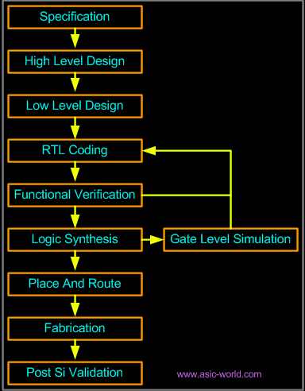

# Notes from ASIC-World
## Introduction
- Verilog is a hardware description language.
- Hardware Description Language is used to describle digital hardware at any level(from flip-flop to a network switch).
```verilog
// A simple D flip-flop
module d_ff(d, clk, q, q_bar);
input d, clk
output q, q_bar
wire d, clk
reg q, q_bar

always @ (posedge clk)
begin
	q <= d;
	q_bar <= !d;
end

endmodule
```
- Verilog allows one to design hardware at different levels of abstraction.
	- Behavoiral Level
	- Register Transfer Language(RTL)
	- Gate level
	- Switch level

## Design Styles
### Bottom-up Design
- Traditional Method.
- Gate-level Design.
- Not scalable.

### Top-Down Design
- Functional method.
- Perfered by most engineers.
- It also allows testing, easy change of different technologies, a structured system design.
- But not practical, so most of the design is hybrid of the the two.



## Verilog Abstraction Levels
### Behavorial Level
- Design is expressed by concurrent algorithms.
- Each algorithm is sequential
- Functions, tasks and blocks are the main elements
- No regard to structural relization of the design

### Regsiter Transfter Language
- Specify circuits by operation and transfer of data between registers
- clock used
- Any code that is synthesizable is called **RTL code**

### Gate Level
- Logical links between components and timing characteristics
- Signals are discrete
- They take only one of the following level (1, 0, X, Z)
- They are programmed using gates
- It is not a scalable method so mostly it is generated by synthesis tools
