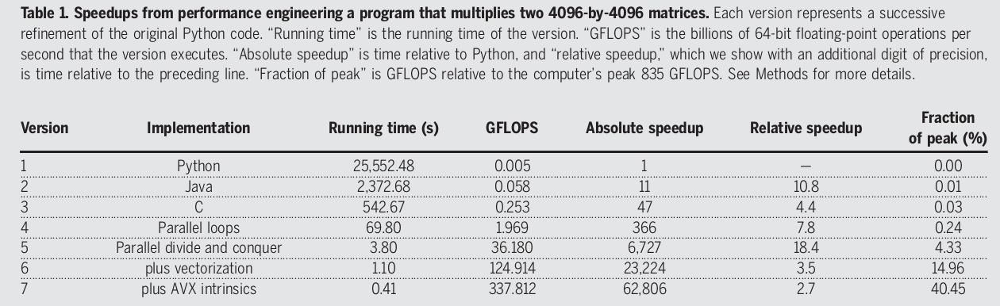

**LinK**: https://science.sciencemag.org/content/368/6495/eaam9744
**Authors**: Charles E. Leiserson, Neil C. Thompson, Joel S. Emer, Bradley C. Kuszmaul, Butler W. Lampson, Daniel Sanchez, Tao B. Schardl
# Top vs Botton of the Computing Stack or (Software, Algorithms & Hardware) vs (physics)
* We are reaching the limits of physics interms of semiconductor miniaturization
* Until now, We have been riding on the shoulders of Semiconductor Techonology for Performance gains fueled by Moore's Law and Dennard Scaling
* Dennard Scaling ran out of gas in 2004 and Moore's law is slowing down
* The authors now wants us to turn towards Top of the Computing Stack, namely
  * Software
  * Algorithms
  * Hardware
* Though the above components have been growing along side Moore's law they are needed more now
* The authors also point out that the return from the Top will be **Uneven, Opportunistic, Sporadic and law of diminishing returns**
* Though there may be exciting technologies like Quantum Computing, Neuromorphic Computing, Graphene Silicon Semiconductors etc. The Authors & 2018 Turing Award Winners David Patterson & John Hennessey point out that they are in their infancy and can not compete with semi conductor tech.

## Software
* During the regime of Moore's law, Software developers were more concerned about the development time rather the runtime performance of the application. This led to an enormous "Software Bloat"
* The authors provide Matrix-Matrix Multiplication as an example by implementing with various levels of abstraction

* The authors also claim that Software Bloat is caused by altering already existing solution to solve a new problem which is similar

### Steps for Software Performance Engineering
1. Measure the Performance of Program 
2. Make a change to program A -> A'
3. Measure The performance of Program A'
4. If Slow, go to Step 2

## Algorithms
*"performance gains due to improvements in algorithms have vastly exceeded even the dramatic
performance gains due to increased processor speed"*
* Algorithmic advancements take time and human ingeunity
* Progress in algorithms can happen by
  * Tackling new problem domain
  * addressing the scalability 
  * Tailoring algorithms to take advantage of modern hardware
* Sublinear algorithms provide a solution of scalability

## Hardware
* Software Developers rode on architectures of the Moore's law era which were faster every generation but also general purpose and serial
* Post Dennard Scaling (2004), Architectures have gone parallel by providing multiple core over faster single threaded performance
* By Utilizing the parallelism in the hardware, one can achieve way more performance
* One such example of a exteremly parallel processor is the GPU
* There are a lot of innvoations that can happen in the hardware like more parallel units, integrated memory and GPU(Intel SunnyCove or AMD's APUs)
* Doman Specific Architectures like GPUs and TPUs can provide significant gains in performance and power.

## Big Components
* A big components is a resuable software with typically more than a million lines of code, hardware of comparable complexity or a hybrid
* Modularity of big components an aid performance engineering
* Modernizing the ISA can improve performance. ISA has been kept unchanged for compatability reasons
* Incentives must be provided for such changes to Big Components and Collaborative method of changing components can justify huge costs in the performance refactoring

## Conclusion
* Performance atleast in the near future will be from the Top of the Computing Stack
* The gains may be Uneven, opportunistic, Sporadic and Subject to diminishing returns