# Digital Circuits
> Circuit is a block box with the followings
1. one or more inputs  
2. one or more outputs  
3. Functional Specifciation - Relationship between inputs and outputs  
4. Timing Specification or requirements - Delay between inputs changing and output responding.  

> Digital Circuit: A circuit that processes discrete valued variables.

> Element : It is a circuits with inputs, outputs and specification.

> Node : Conveys discrete values to the circuits

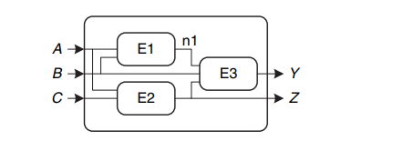

* In the above image A, B, C, n1, Y, Z are nodes and E1, E2, E3 are elements.

## Types of Digital Circuits
* There are two types of digital circuits
    1. Combinational
    2. Sequential

> Combinational : Output solely depend on the input.

> Sequential : Output depends on input and the previous state.

## Combinational Logic

* Every combinational circuit consits of the following
    1. Every circuit element itself is combinational
    2. Every node is either desginated as input or connects to exactly one output terminal
    3. Every circuit contains no cyclic path, every path to the circuit visits each circuit at most once.

## Boolean Equations

* Deals with equations either **TRUE** or **FALSE**.
* They are useful in expressing digital logic.

## Terminology

* `A` - a boolean variable
* `A'` - complement of `A`
* `AB` - AND operation on two varaibles
* `ABC` - minterms which are all the variables of a equation joined by AND. `AB` is not a minterm because it doesn't include `C`.
* `A + B + C` - similarly maxterms
* Precedence of operations - NOT, AND and OR

## Sum of Products Representation

* Every row in a truth table whose value is 1 can be represented as a **minterm**

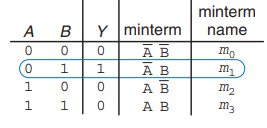

* Thus the boolean equation for the truth table can be presented as sum of minterms.

## Product of Sum Canonical Form

* The complement of the sum of products is product of sums
* Every row in a truth table associated with 0 can be represented as a **maxterm**

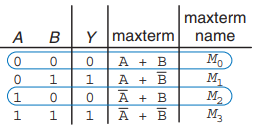

* Sometimes Product of sum yield a better boolean equation than sum of products. It is number of zeros in truth table is lesser than ones.

## Boolean Algebra

* The method of simplifying boolean equations is called **Boolean Algebra**.
* Set of axioms that are believed to be correct.
* Boolean Algebra on one variable

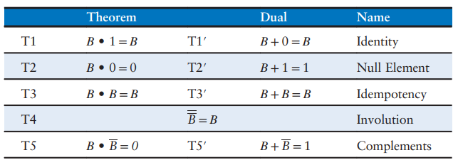

* Boolean Algebra on several variables

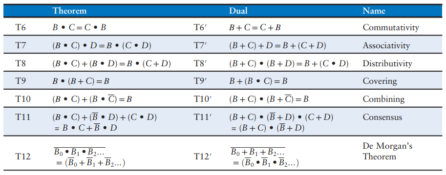

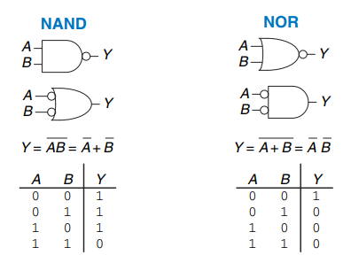

* With NAND and NOR almost all circuits can be built from them. So they are called universal gates.

## From Logic to Gates

* Thus a boolean logic can be mapped to gates.
* `Y = A'B'C' + AB'C' + AB'C` can be mapped as 
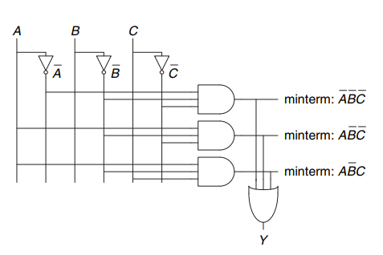

* But it can be simplified as

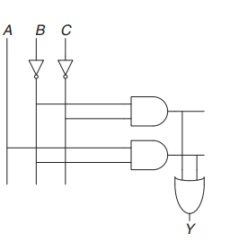

* Thus simplification of boolean logic leads to more optimal representation of gates which can be synthesized by software. Most EDA tools has a sythesizer that takes a look a the high level HDL and synthesizes gates which is also the simplified version.

* Variables with don't care condition **X** means that the value of the variables does not affect the outcome of the circuit.
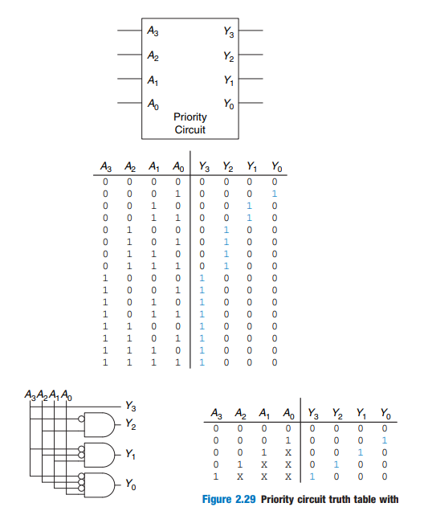

## Multilevel Combinational Logic
* Thus sum of products is a two level logic because it consists of literals connected to a level of AND and another level of OR.
* Mutilevel circuits have multiple levels of operations operating on them.

## Hardware Reduction
* Composing multiple gates(multi-level gates) instead of multiple input hardware gates greatly increases hardware.
* for example, an 8 input XOR gates consists of 128 AND and 128 OR gates.

## Bubble Pushing
* Bubble pushing converts logical circuits using AND, OR to NAND, NOR and NOT which can be used in desgin.
* Bubble pushing helps use to cancel out bubbles and used to determine the boolean function.

## X's and Z's
* X - means the circuits is driven to both 0 and 1 simultaneously. It is called an **Illegal** value.
* This situation is called contention and it should be avoided.
* Contention leads to large amount of current being passed to the circuit damaging the circuit.
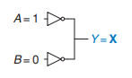
* The above circuit is both 1 and 0 at the same time. 
* Z - called the **Floating** value is when a node's value is 0, 1 or anyvalue inbetween. for example, a circuit not connected to the input, the output node will be Z value.

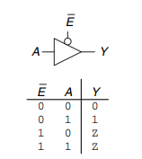

* The above circuit is a tristate buffer, thus when the E = 1, the circuits is in a floating value depending on the input. Tristate buffers are used to implement shared busses where multiple components are connected by sharing a bus. Every component when enabled will be able to read te message. Point-to-Point connections are used where components are connected directly to each other instead of a shared bus.

## Karnaugh Maps

* Graphical method to simplify boolean equation.
* Was invented by Maurice Karnaugh, Telecommunication Engineer at Bell Labs.
* It works well upto 4 variables.

### K-Map construction
1. List out the variables in pair if avaiable.
2. Each cell corresponds to one of the possible values of the variable.
3. The values are arranged in such a way that each adjacent bits differ only in one position even when the table folded like a torus(Gray Code).e.g. 00, 01, 11, 10
4. Each square in table is a minterm.
5. The cell value is 1 if the minterm is present in the boolean equation otherwise 0.
6. Cells are circled if they have the same value.
    1. Minimize the number of circles needed.
    2. The circle size is chosen to be power of 2.
    3. Each circle should large as possible.
    4. A circle may warp around the edge of K-map.
    5. A 1 can be circle multiple times if circles can be minimized.
    6. Don't care condition, where the value of the variable is unimportant or the can never occur. It can also be circled.

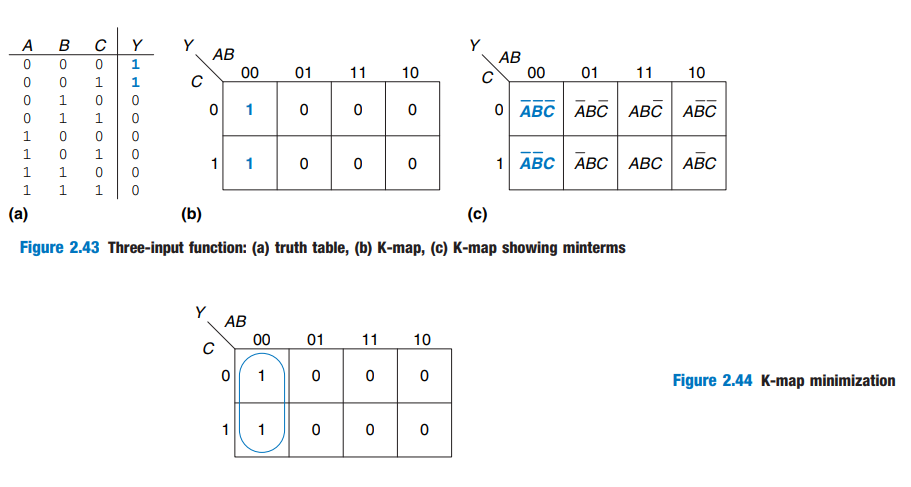

## Combinational Building Blocks

### Multiplexer or Mux
1. Many-to-one circuits.
2. Chooses between one of the inputs depending on the select signal.

### Decoder
1. It is similar to Mux except it convert its multiple input signal into one of many output signal.
2. It has N input and 2 ^ N outputs.

## Timing
1. Making a circuit run fast.
2. Rising edge - Circuit going from Low to High, Falling edge - Circuit going from High to Low.

### Propagation and Contamination Delay

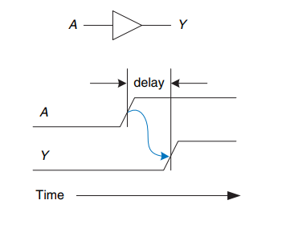

1. Propagation Delay: Maximum time delay between when the input changes to 1 and the output responds to the change in input.
2. In timing specfication of many circuits propagation delay is mentioned.
3. Contamination Delay: minimum time when an input changes until any output starts to change.

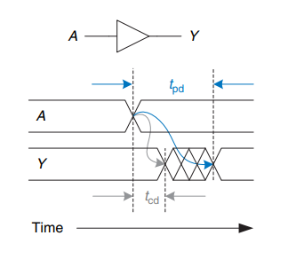

4. The delay is due to law of the universe which is capped by the speed of light.
5. Propagation Delay will be the sum of the propagation delay of the circuit elements in the critical path.
6. 